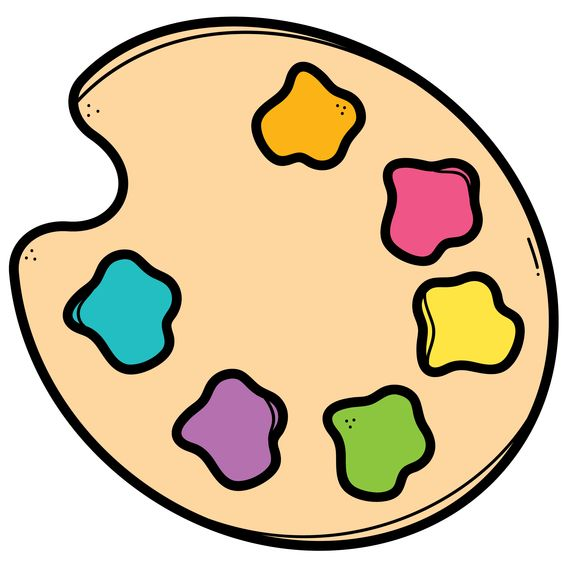
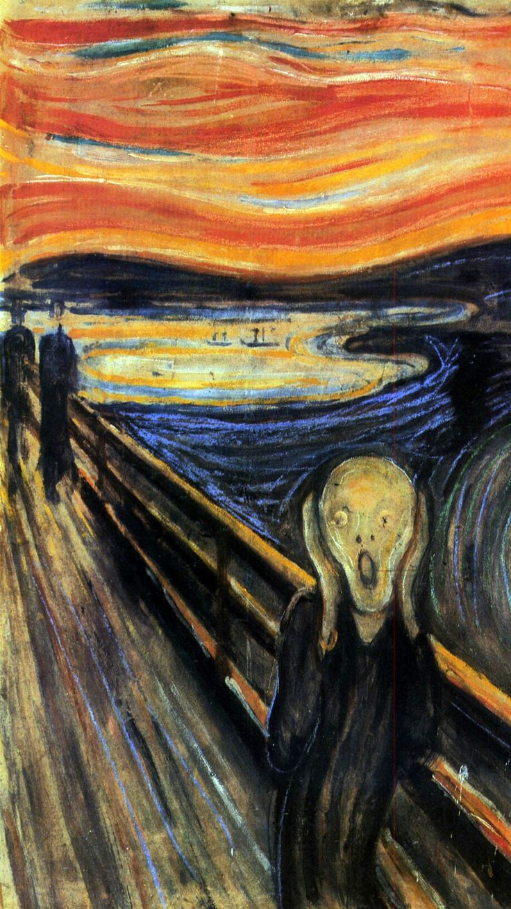

<html>
<html lang="es">
<head>
    <meta charset="UTF-8">
    <meta name="viewport" content="width=device-width, initial-scale=1.0">
    <title>Página sistemas</title>
    
</head>
<body>
    

        <h1><marquee behavior="alternate">ARTE</marquee></h1>
    

    
 

    

        El arte es una actividad humana que tiene como objetivo crear obras culturales.  
        Es una expresión de la creatividad humana que se manifiesta en obras que pueden ser apreciadas por los sentidos. 
        El arte puede ser una reproducción, construcción o expresión que deleita,  
        emociona o produce un choque.
    

     
 

    <h2>Algunos tipos de arte son:</h2>

    <h3><a href="arte1.html" style="text-decoration: none; color: black;">Artes Estéticas o Espaciales</a></h3>
    <h3><a href="arte2.html" style="text-decoration: none; color: black;">Artes Mixtas</a></h3>
    <h3><a href="arte3.html" style="text-decoration: none; color: black;">Artes Escénicas</a></h3>

    

        Selecciona a qué artistas conoces:
    

    

        <input type="checkbox"> Pablo Picasso 
        <input type="checkbox"> Leonardo da Vinci 
        <input type="checkbox"> Vincent van Gogh 
        <input type="checkbox"> Diego Velázquez 
        <input type="checkbox"> Claude Monet 
    

    
</body>
</html>
